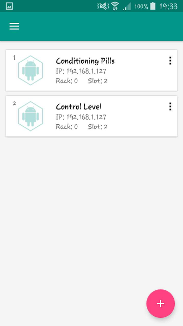
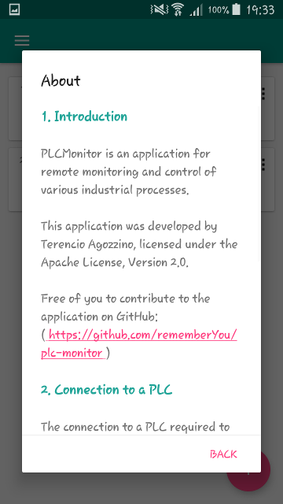
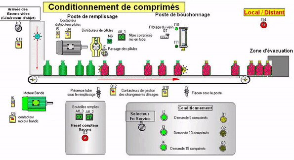
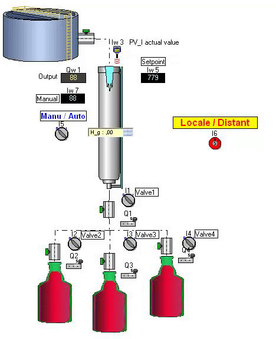

PLCMonitor
===============================

PLCMonitor is an prototype Android application for remote monitoring and control of
various industrial processes.

This means that this application is far from complete and its objective is not
to be, but to develop a reusable coding template for larger projects.

The application only reads applications from various PLCs, the writing is similar.

Two types of users exist in order to be able to manage different privileges to
give read and write access only for certain users.

 

 

Be careful that only two PLCs from Siemens are available :
  1. Conditioning of pills, controlled by the PLC S7-1516 2DPPN
  2. Liquid level control, controlled by the PLC S7-1214C
  
This project may interest two types of people :
  1. Developers wishing to use this project, which brings together several good
     practices, for their individual projects.
  2. People who want to complete this project.

The two industrial processes shown above were simulated using
[ProcesSim](http://www.heh.be/article-320-Presentation-de-ProcesSim).

You can download the two industrial processes here:

  - [Conditioning of pills](assets/resources/pills)
  - [Liquid level control](assets/resources/level-control)

--------------------

### Conditioning of Pills ###

") ")

### Liquid Level Control ###

")
")

### Database ###

This project uses OrmLite as a database, implemented using three main classes :

  - `DatabaseHelper`: allows the creation and updating of the database. In
    addition, this class provides the CAD used by third party classes.
	
  - `DatabaseConfigUtil`: provides the configuration file to avoid the use of
    annotations at startup, which is slow under Android.
	
	Note: with this mechanism, annotations are 20 times faster than native
    Android calls.
	
  - `DatabaseModule`: database module ensuring dependency injection.
  
The entire database is encrypted using SQLCipher using a 100-character randomly
generated key for each device downloading the application.

--------------------

### Dependency Injection ###

Dagger has been used for code generation and various annotations. This also
facilitates the creation of reusable and interchangeable modules.

The `DatabaseModule` class allows to provide the different DAO (Data Access
Object) models and the `ApplicationComponent` class provides the database module
to the specified fragments and activities.

--------------------

### RxJava ###

PLCs requiring read R/W access to them using an asyncroneous thread in order not
to block the workflow. Reactive Extension (RxJava) has been used for these
asynchronous threads and event requests using observable sequences.

--------------------

### Thanks ###

I would like to thank the [Haute École en Hainaut (HEH)](http://www.heh.be/) for
allowing me to work on this project by providing me with a key for `ProcesSim` and
`SIMATIC WinAC RTX` to simulate a PLC.

--------------------

### Contributions ###

Various functions may be optimized or spelling errors may occur. If you want to
make your own correction on these files, you are free to do so.

--------------------

### License ###

Code is under the [Apache Licence v2](https://www.apache.org/licenses/LICENSE-2.0.txt).
